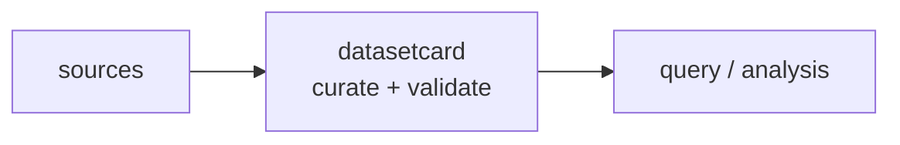

<a name="top"></a>
<div align="center">


# DATASETCARD

### Auto Dataset Cards / datasheets with Croissant + provenance


[](https://pypi.org/project/cognis-datasetcard/) [](https://github.com/cognis-digital/datasetcard/actions) [](LICENSE) [](https://github.com/cognis-digital)

*Data & Datasets — zero-setup quality, lineage, and governance.*

</div>

```bash
pip install cognis-datasetcard
datasetcard scan .            # → prioritized findings in seconds
```


<!-- cognis:example:start -->
## 🔎 Example output

Real, reproducible output from the tool — runs offline:

```console
$ datasetcard-emit --version
datasetcard 0.1.0
```

```console
$ datasetcard-emit --help
usage: datasetcard [-h] [--version] [--format {table,json}]
                   {profile,croissant,card,datasheet} ...

Auto-generate dataset cards, Croissant metadata, and datasheets.

positional arguments:
  {profile,croissant,card,datasheet}
    profile             profile a dataset file
    croissant           emit Croissant JSON-LD metadata
    card                emit a HuggingFace-style dataset card (markdown)
    datasheet           emit a Datasheets-for-Datasets skeleton

options:
  -h, --help            show this help message and exit
  --version             show program's version number and exit
  --format {table,json}
                        output format (default: table)
```

> Blocks above are real `datasetcard` output — reproduce them from a clone.

**Sample result format** _(illustrative values — run on your own data for real findings):_

```
{
"actor": "John Doe",
"incident_id": "1234567890",
"reporter": "Jane Smith",
"timestamp": 1643723400,
"findings": [
    {
        "id": "finding-1",
        "type": "indicator",
        "name": "Suspicious Domain",
        "description": "Domain used for phishing attacks",
        "url": "https://example.com/phishing"
    },
    {
        "id": "finding-2",
        "type": "malware",
        "name": "Ransomware",
        "description": "Malware that encrypts files",
        "hash": "abc123"
    }
]
}
```

<!-- cognis:example:end -->

## Usage — step by step

1. Install the CLI (Python 3.9+):

   ```bash
   pip install datasetcard    # or: pip install .   from a checkout
   ```

2. Profile a dataset — the `profile` subcommand reports rows, columns, per-column types, missing %, uniqueness, a SHA-256, and PII flags for a CSV/TSV/JSONL file:

   ```bash
   datasetcard profile data.csv
   ```

3. Generate documentation artifacts from the same input:

   ```bash
   datasetcard card data.csv --name my-dataset > DATASET_CARD.md   # HuggingFace-style card
   datasetcard datasheet data.csv > DATASHEET.md                   # Datasheets-for-Datasets skeleton
   datasetcard croissant data.csv --format json > croissant.jsonld # Croissant JSON-LD metadata
   ```

4. Read the profile programmatically with the global `--format json` flag (note: it precedes the subcommand):

   ```bash
   datasetcard --format json profile data.csv | jq '.pii_flags'
   ```

5. Regenerate the card in CI so documentation tracks the data:

   ```bash
   datasetcard card data.csv > DATASET_CARD.md && git diff --exit-code DATASET_CARD.md
   ```


## Contents

- [Why datasetcard?](#why) · [Features](#features) · [Quick start](#quick-start) · [Example](#example) · [Architecture](#architecture) · [AI stack](#ai-stack) · [How it compares](#how-it-compares) · [Integrations](#integrations) · [Install anywhere](#install-anywhere) · [Related](#related) · [Contributing](#contributing)

<a name="why"></a>
## Why datasetcard?

ML data governance

`datasetcard` is single-purpose, scriptable, and self-hostable: point it at a target, get prioritized results in the format your workflow already speaks (table · JSON · SARIF), gate CI on it, and let agents drive it over MCP.

<div align="right"><a href="#top">↑ back to top</a></div>

<a name="features"></a>
## Features

- ✅ Sha256 File
- ✅ Profile Dataset
- ✅ Build Croissant
- ✅ Build Card Markdown
- ✅ Build Datasheet
- ✅ Runs on Linux/macOS/Windows · Docker · devcontainer
- ✅ Ports in Python, JavaScript, Go, and Rust (`ports/`)

<div align="right"><a href="#top">↑ back to top</a></div>

<a name="quick-start"></a>
## Quick start

```bash
pip install cognis-datasetcard
datasetcard --version
datasetcard scan .                       # scan current project
datasetcard scan . --format json         # machine-readable
datasetcard scan . --fail-on high        # CI gate (non-zero exit)
```

<div align="right"><a href="#top">↑ back to top</a></div>

<a name="example"></a>
## Example

```text
$ datasetcard scan .
  [HIGH    ] DAT-001  example finding             (./src/app.py)
  [MEDIUM  ] DAT-002  another signal              (./config.yaml)

  2 findings · risk score 5 · 38ms
```

<div align="right"><a href="#top">↑ back to top</a></div>

<a name="architecture"></a>
## Architecture



<div align="right"><a href="#top">↑ back to top</a></div>

<a name="ai-stack"></a>
## Use it from any AI stack

`datasetcard` is interoperable with every popular way of using AI:

- **MCP server** — `datasetcard mcp` (Claude Desktop, Cursor, Cognis.Studio, [uncensored-fleet](https://github.com/cognis-digital/uncensored-fleet))
- **OpenAI-compatible / JSON** — pipe `datasetcard scan . --format json` into any agent or LLM
- **LangChain · CrewAI · AutoGen · LlamaIndex** — wrap the CLI/JSON as a tool in one line
- **CI / scripts** — exit codes + SARIF for non-AI pipelines

<div align="right"><a href="#top">↑ back to top</a></div>

<a name="how-it-compares"></a>
## How it compares

| | **Cognis datasetcard** | HF dataset cards |
|---|:---:|:---:|
| Self-hostable, no account | ✅ | varies |
| Single command, zero config | ✅ | ⚠️ |
| JSON + SARIF for CI | ✅ | varies |
| MCP-native (AI agents) | ✅ | ❌ |
| Polyglot ports (JS/Go/Rust) | ✅ | ❌ |
| Open license | ✅ COCL | varies |

*Built in the spirit of **HF dataset cards**, re-framed the Cognis way. Missing a credit? Open a PR.*

<div align="right"><a href="#top">↑ back to top</a></div>

<a name="integrations"></a>
## Integrations

Pipes into your stack: **SARIF** for code-scanning, **JSON** for anything, an **MCP server** (`datasetcard mcp`) for AI agents, and a webhook forwarder for SIEM/Slack/Jira. See [`docs/INTEGRATIONS.md`](docs/INTEGRATIONS.md).

<div align="right"><a href="#top">↑ back to top</a></div>

<a name="install-anywhere"></a>
## Install — every way, every platform

```bash
pip install "git+https://github.com/cognis-digital/datasetcard.git"    # pip (works today)
pipx install "git+https://github.com/cognis-digital/datasetcard.git"   # isolated CLI
uv tool install "git+https://github.com/cognis-digital/datasetcard.git" # uv
pip install cognis-datasetcard                                          # PyPI (when published)
docker run --rm ghcr.io/cognis-digital/datasetcard:latest --help        # Docker
brew install cognis-digital/tap/datasetcard                             # Homebrew tap
curl -fsSL https://raw.githubusercontent.com/cognis-digital/datasetcard/main/install.sh | sh
```

| Linux | macOS | Windows | Docker | Cloud |
|---|---|---|---|---|
| `scripts/setup-linux.sh` | `scripts/setup-macos.sh` | `scripts/setup-windows.ps1` | `docker run ghcr.io/cognis-digital/datasetcard` | [DEPLOY.md](docs/DEPLOY.md) (AWS/Azure/GCP/k8s) |

<div align="right"><a href="#top">↑ back to top</a></div>

<a name="related"></a>
## Related Cognis tools

- [`duckprobe`](https://github.com/cognis-digital/duckprobe) — Zero-setup data-quality checks on any file or warehouse via DuckDB
- [`schemadrift`](https://github.com/cognis-digital/schemadrift) — Schema-change detector and data-contract tests
- [`csvlens`](https://github.com/cognis-digital/csvlens) — Fast CLI for profiling and cleaning huge CSV / Parquet files
- [`piiscan`](https://github.com/cognis-digital/piiscan) — PII discovery across warehouses and lakes (data-side scanner)
- [`lineagemap`](https://github.com/cognis-digital/lineagemap) — Column-level lineage extracted from SQL and dbt
- [`seedforge`](https://github.com/cognis-digital/seedforge) — Synthetic test-data generator with referential integrity

**Explore the suite →** [🗂️ all 170+ tools](https://github.com/cognis-digital/cognis-neural-suite) · [⭐ awesome-cognis](https://github.com/cognis-digital/awesome-cognis) · [🔗 cognis-sources](https://github.com/cognis-digital/cognis-sources) · [🤖 uncensored-fleet](https://github.com/cognis-digital/uncensored-fleet) · [🧠 engram](https://github.com/cognis-digital/engram)

<div align="right"><a href="#top">↑ back to top</a></div>

<a name="contributing"></a>
## Contributing

PRs, new rules, and demo scenarios are welcome under the collaboration-pull model — see [CONTRIBUTING.md](CONTRIBUTING.md) and [SECURITY.md](SECURITY.md).

> ### ⭐ If `datasetcard` saved you time, **star it** — it genuinely helps others find it.

## Interoperability

`{}` composes with the 300+ tool Cognis suite — JSON in/out and a shared
OpenAI-compatible `/v1` backbone. See **[INTEROP.md](INTEROP.md)** for the
suite map, composition patterns, and reference stacks.

## License

Source-available under the **Cognis Open Collaboration License (COCL) v1.0** — free for personal, internal-evaluation, research, and educational use; **commercial / production use requires a license** (licensing@cognis.digital). See [LICENSE](LICENSE).

---

<div align="center"><sub><b><a href="https://cognis.digital">Cognis Digital</a></b> · one of 170+ tools in the <a href="https://github.com/cognis-digital/cognis-neural-suite">Cognis Neural Suite</a> · <i>Making Tomorrow Better Today</i></sub></div>
